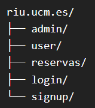

# Planning
## Sitemap

## Funcionalidades
riu.ucm.es
- Redirecciona a /login si no se ha iniciado sesión
- Grid de instalaciones

/admin
- Sidebar
  - Gestión Organización
  - Gestión Instalaciones
    - Listado instalaciones
    - Crear instalación
    - Ver instalación + lista de espera
    - Modificar instalación + lista de espera
  - Gestión Usuarios
    - Ver listado
    - Filtrar listado
    - Ver usuario + historial
    - Validar usuario
  - Reportes (Estadísticas y Listados)
  - Comunicación

/user
- Correo
- Reservas actuales (cancelables)

/instalacion
- Instalación específica con formulario de reserva

## Flujos
### Registro
1. Usuario en /signup rellena formulario
- Client side validation:
  - texto normal - nombre, apellidos, contraseña
  - dropdown - facultad, curso, grupo
  - **email** @ucm.es
2. Administrador valida usuario en /admin
3. Se envía correo a alumno (Registro validado)